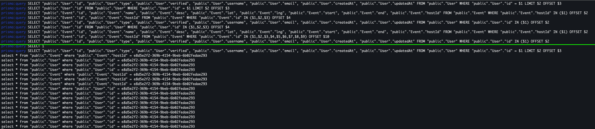

### Demo topics

1. Prisma schema

   - Prisma migrate
   - Prisma generate
   - Prisma types: `node_modules/.prisma/client/index.d.ts`

2. Nexus + Prisma

- npm nexus-prisma: `./generated/nexus-prisma/**/*`
- 100% typesafety coverage
- Vanilla GQL queries
- Prisma GQL queries
- TBD: `create-batch-resolver`

### See data-loader magic out-of-the-box

